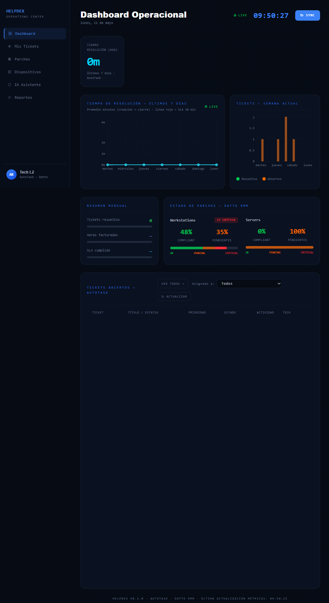

# HELPDEX — MSP Operations Center

> Dashboard interactivo para Ingenieros de Soporte: gestión de tickets (AutoTask), monitoreo de dispositivos y parches (Datto RMM), y asistente con IA (OpenAI).



## Features

- **Tickets en tiempo real** desde AutoTask con estados, prioridades, empresa/contacto y técnico asignado
- **Sugerencias de IA por ticket** generadas con OpenAI, con contexto técnico del ticket
- **Chat con asistente IA** para consultas durante el trabajo
- **Dispositivos y Parches** desde Datto RMM (compliant, pendientes, críticos — Workstations y Servers)
- **Dashboard de métricas** con tickets abiertos/resueltos, SLA breach y gráficos semanales
- **Arquitectura Clean** en el backend (Domain → Application → Infrastructure → HTTP)

## Stack

| Capa | Tecnología |
|------|------------|
| Frontend | React 18 + Vite + Tailwind CSS v4 + React Router v6 + Recharts |
| Backend | Laravel 10+ (PHP 8.2+) — API REST, Clean Architecture |
| IA | OpenAI API (sugerencias por ticket + chat) |
| PSA | AutoTask REST API (tickets, contactos, recursos) |
| RMM | Datto RMM API (OAuth2 — dispositivos y parches) |

## Getting started

### Prerequisites

- PHP 8.2+ y Composer
- Node.js 20+ y npm
- Claves de API: AutoTask, Datto RMM, OpenAI

### Backend (Laravel)

```bash
cd backend
composer install
cp .env.example .env
php artisan key:generate
# Editar .env con las claves de AutoTask, Datto RMM y OpenAI
php artisan config:clear
php artisan serve
# API disponible en http://127.0.0.1:8000
```

### Frontend (React + Vite)

```bash
cd frontend
npm install
npm run dev
# App disponible en http://localhost:5173
```

> [!NOTE]
> Vite hace proxy automático de todas las rutas `/api/*` al backend en `http://127.0.0.1:8000`. No es necesario configurar CORS en desarrollo.

## Environment variables

Copia `backend/.env.example` a `backend/.env` y completa las siguientes variables:

| Variable | Descripción |
|----------|-------------|
| `AUTOTASK_ZONE_URL` | URL de zona AutoTask (descubrir vía `GET /api/tickets/zone-info?username=`) |
| `AUTOTASK_USERNAME` | Email del usuario API-only en AutoTask |
| `AUTOTASK_SECRET` | Contraseña del usuario API (entre comillas si tiene `#` o `=`) |
| `AUTOTASK_INTEGRATION_CODE` | Código de integración de la pestaña Security del usuario API |
| `AUTOTASK_VERIFY_SSL` | `false` en Windows para evitar errores cURL 60 |
| `DATTO_RMM_API_URL` | URL de la plataforma Datto RMM (ej. `https://vidal-api.centrastage.net`) |
| `DATTO_RMM_API_KEY` | Clave API de Datto RMM (Setup → Users → Generate API Keys) |
| `DATTO_RMM_API_SECRET` | Secreto API de Datto RMM |
| `OPENAI_API_KEY` | Clave de OpenAI para sugerencias y chat |
| `AUTOTASK_QUEUE_IDS` | IDs de colas para filtrar tickets (opcional, separados por coma) |
| `AUTOTASK_WEB_URL` | URL web de AutoTask para links "Ver en AutoTask" (ej. `https://ww14.autotask.net`) |

## API endpoints

| Método | Ruta | Descripción |
|--------|------|-------------|
| `GET` | `/api/tickets` | Lista tickets del técnico |
| `GET` | `/api/tickets/{id}` | Detalle de ticket con empresa, contacto y técnico |
| `GET` | `/api/tickets/zone-info` | Descubrir zona AutoTask por username |
| `GET` | `/api/dashboard/metrics` | Métricas agregadas (tickets, resueltos, SLA) |
| `GET` | `/api/devices` | Lista de dispositivos desde Datto RMM |
| `GET` | `/api/patches/workstations` | Estado de parches — Workstations |
| `GET` | `/api/patches/servers` | Estado de parches — Servers |
| `POST` | `/api/ai/suggestions` | Sugerencias IA para un ticket |
| `POST` | `/api/ai/chat` | Chat con asistente IA |

## Project structure

```
titi/
├── backend/                    # Laravel API (Clean Architecture)
│   ├── app/
│   │   ├── Domain/             # Entidades y enums (Ticket, TicketStatus)
│   │   ├── Application/        # Casos de uso (ListMyTickets, ChatWithAssistant…)
│   │   ├── Infrastructure/     # Clientes externos (AutoTask, DattoRmm, OpenAI)
│   │   └── Http/Controllers/   # Controladores HTTP delgados
│   ├── config/
│   │   ├── autotask.php        # Mapas de estados, prioridades y colas
│   │   └── datto_rmm.php       # Config Datto RMM (SSL, TTL de caché)
│   └── routes/api.php
└── frontend/                   # React SPA
    └── src/
        ├── app/                # Rutas globales y estilos
        ├── features/
        │   ├── dashboard/      # Dashboard principal con métricas
        │   ├── tickets/        # Mis Tickets
        │   ├── devices/        # Dispositivos Datto RMM
        │   ├── patches/        # Estado de parches
        │   ├── ai/             # IA Asistente (chat)
        │   └── reports/        # Reportes
        └── shared/api/         # Cliente HTTP base (fetch wrapper)
```

## Debugging

| Problema | Solución |
|----------|----------|
| Error 401 de AutoTask | Verificar que el recurso tenga nivel "API User (API-only)" y un Tracking identifier configurado |
| Config no actualiza | Ejecutar `php artisan config:clear` después de cada cambio en `.env` |
| Error SSL / cURL 60 | Agregar `AUTOTASK_VERIFY_SSL=false` y/o `DATTO_RMM_VERIFY_SSL=false` en `.env` |
| Frontend no conecta al backend | Verificar que `php artisan serve` esté corriendo en `http://127.0.0.1:8000` |
| URL "Ver en AutoTask" incorrecta | Establecer `AUTOTASK_WEB_URL` explícitamente y ejecutar `php artisan config:clear` |
| Status IDs no coinciden | Ajustar `open_status_ids`, `closed_status_ids` y `resolved_status_ids` en `config/autotask.php` |
